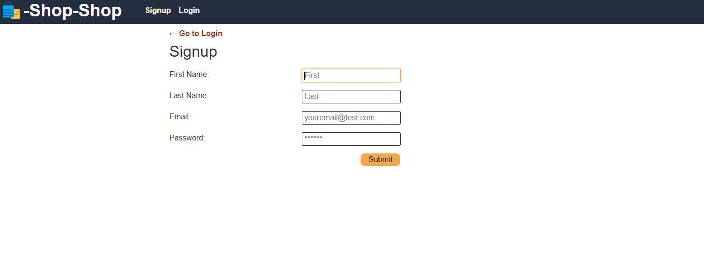
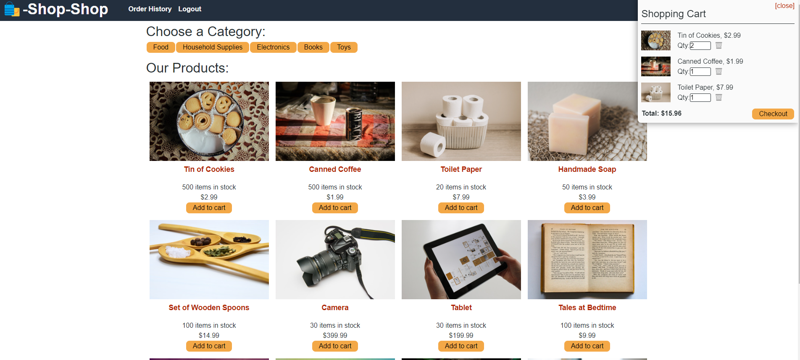
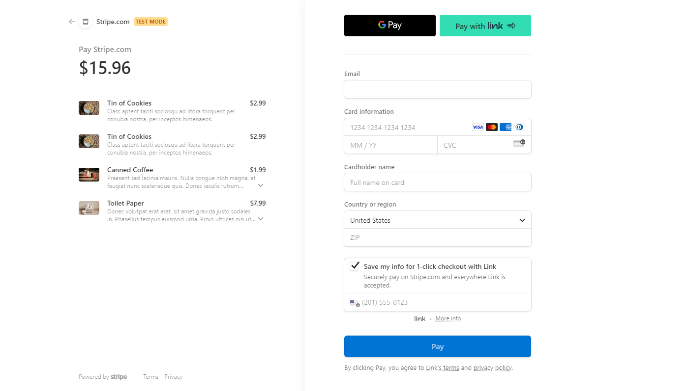

# Redux Store for E-Commerce Platform

This project is aimed at refactoring an existing e-commerce platform to use Redux for global state management instead of the Context API. The goal is to maintain the functionality of the original application while implementing Redux to manage global state.

## Overview
The project involves refactoring the existing React front end to interact with a Redux store instead of using the Context API. This includes setting up Redux providers, reducers, actions, and selectors to manage the application's state.

## Technologies Used
- React
- Redux
- Node.js
- Express.js
- MongoDB
- HTML/CSS
- JavaScript

## Installation
To install and run the project locally, follow these steps:

1. Clone the repository:

<code>git clone <repository-url></code>

2. Navigate to the project directory:

<code>cd <project-directory></code>

3. Install dependencies:

<code>npm install</code>

4. Start the development server:

<code>npm start</code>

## Usage
After installation, you can access the application by visiting http://localhost:3000 in your web browser. The application allows users to browse products, add them to the cart, and proceed to checkout.

## Deployment
The application can be deployed to a live server using platforms like Heroku, Netlify, or Vercel. Follow the platform-specific deployment instructions to deploy the application.

## Screenshots

## Contribution
Contributions to the project are welcome. If you would like to contribute, please follow these steps:

## Fork the repository
1. Create a new branch for your feature or bug fix
2. Make changes and commit them to your branch
3. Push to your forked repository
4. Submit a pull request to the main repository's main branch

